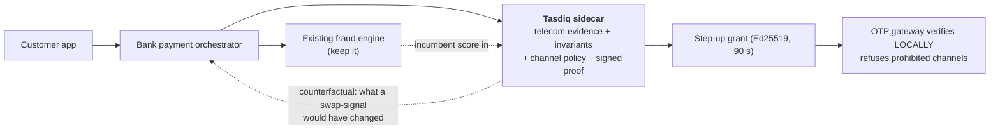
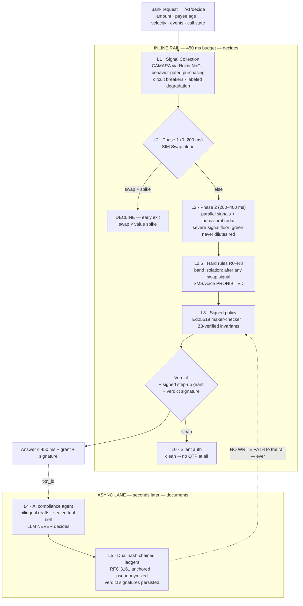

<div align="center">

# Tasdiq · تصديق

### The Step-Up Firewall & Evidence Ledger for instant payments

**Telecom-verified risk decisions that dictate WHICH authentication channels a bank may use — cryptographically enforced, machine-checked, signed.**

*During a SIM swap, an SMS OTP is a delivery service for the attacker. Tasdiq makes that OTP impossible to send.*

[Tests 117/117](#evidence--receipts) · [Proofs I1–I6](#mathematically-proved-safety) · [Quickstart](#quickstart) · [Architecture](docs/ARCHITECTURE.md) · [White Paper](business/WHITE_PAPER.md)


</div>

---

## What Tasdiq is

Before a bank releases an instant payment, it calls Tasdiq once. Tasdiq fuses
**telecom-network evidence** (GSMA Open Gateway / CAMARA: SIM Swap, Device
Status, Device Swap — via Nokia Network-as-Code) with the bank's own
behavioral context, and returns — inside a **450 ms budget** — a deterministic
verdict:

| | |
|---|---|
| **APPROVE** | clean traffic, **no step-up at all** — the OTP is never sent |
| **ESCALATE** | biometric / WebAuthn only — **the verdict dictates the channel** |
| **DECLINE** | fresh swap × value spike — stopped in 200 ms |

…plus a **signed step-up grant** the bank's OTP gateway verifies locally, a
**verdict signature**, and a hash-chained ledger entry. An async AI agent
writes the bilingual paperwork — it can never touch the decision.

**Positioning:** a **sidecar** that augments the bank's existing fraud stack
(Feedzai / BioCatch / Actimize — keep them all), not a replacement.



## The four attack families

| # | Attack | The tell | Tasdiq's answer |
|---|---|---|---|
| 1 | **SIM swap** | number ported; victim's OTPs land on the attacker's SIM | live swap ⇒ SMS/voice **structurally prohibited** (R0) |
| 2 | **Device re-registration** | number moved to a new device | Device Swap corroboration + aged-window rule (R6) |
| 3 | **Snatch & run** | phone stolen unlocked; telecom all green | behavioral radar: spike + new payee ⇒ biometric-only (R5) |
| 4 | **Coached payment** | victim ON THE CALL with the scammer, reading out every OTP | `COOLING_OFF_HOLD` — **nothing completes while the call is live** (R8) |

## Mathematically proved safety

The engine is deterministic, so its rules can be **proved for every possible
input** — not sampled, proved. Every signed policy must pass all six
invariants before it ships:

| Invariant | Statement |
|---|---|
| **I1** | a live SIM swap **never** yields APPROVE — any tier, any inputs |
| **I2** | all signals lost + behavioral anomaly **never** yields APPROVE (blindness buys strictness) |
| **I3** | the payee-velocity trap **always** fires (found a real signed policy where it silently didn't — now structural) |
| **I4** | raising the amount **never** un-blocks a blocked payment |
| **I5** | a live call during payment **never** yields APPROVE |
| **I6** | a sensitive event (credential reset, device registration…) **never** rides Tier 0 — signals are always bought |

```bash
python scripts/prove_policies.py
# === bank-a-v1 ===  [PROVED] I1..I6   === bank-b-v1 ===  [PROVED] I1..I6
# ALL POLICIES PROVE ALL INVARIANTS
```

A 60-sample randomized **differential check** runs the Z3 model and the real
engine side-by-side in CI — the proof is about the code, not a wish.

## Architecture — six layers, one responsibility each



Deep dives: [ARCHITECTURE.md](docs/ARCHITECTURE.md) · [decision pipeline & rule order](docs/ARCHITECTURE.md#decision-pipeline) · [ChannelLock sequence](docs/ARCHITECTURE.md#channellock--how-enforcement-works)

## Cost follows risk — wired, tested, auditable

The behavioral radar is **free** and runs on every payment; telecom money is
spent only where risk justifies it. Every verdict records what it bought:

| Tier | Trigger | Signals bought | Est. cost |
|---|---|---|---|
| **0** | quiet — no flag, no event, not sampled | none | **$0** |
| **1** | mild flag / payee-added event / unknown field / 2% keyed sample | SIM Swap | ~$0.07 |
| **2** | severe flag / takeover-shaped event / coached call | full sweep + aged window | ~$0.21–0.28 |

## Feature map

| Feature | What it does |
|---|---|
| **ChannelLock** | signed short-lived step-up grants; the OTP gateway verifies locally and **refuses prohibited channels** — a Tasdiq outage can never re-enable SMS |
| **Governor / sidecar mode** | takes the incumbent engine's score; **never downgrades it**; Tier-0 verdicts carry the **counterfactual** — what a live swap would have changed (the business case for coverage) |
| **Coached-payment hold (R8)** | call in progress ⇒ nothing dispatchable; 30-min cooling-off + callback on the bank-held number |
| **Event-forced screening** | credential reset / device registration / login anomaly ⇒ SIM check regardless of radar; keyed 2% sampling covers the rest |
| **UNKNOWN semantics** | omitted fields are screened, never read as clean; `data_quality` on every verdict |
| **Verdict signatures** | every decision signed over stable fields (latency excluded — timing is not identity); ledger persists the signature |
| **Replay Lab** | feed a pseudonymized historical log → **signed report**: confirmed-fraud records the policy APPROVES (the damning number), friction, counterfactual exposure, incumbent matrix |
| **Z3 proof gate** | policies that violate an invariant cannot pass CI |

## Evidence & receipts

| Claim | Receipt |
|---|---|
| 117/117 tests | `pytest -q` — engine, proofs, ChannelLock, governor, coached, events, unknown, signatures, Replay Lab |
| p50 334 ms end-to-end (sandbox RTT dominated) · ~3 ms internal · 94% in budget (16 live runs) | `evidence/latency_measurements.json` — dual-reported: sandbox overhead shown, never hidden |
| ~3,000 chained ledger appends/s offline | `evidence/load_test.json` |
| +0.51 held-out incremental recall, 0 FP **on our own generator**, 2 misses **published** | `evidence/ablation_results.json` — honestly scoped: internal consistency, not real-world accuracy |
| Sandbox resolves simulator numbers only; commercial operator coverage is the open gate | `evidence/coverage_probe.json` |

**Claims boundary (never relaxed):** not identity verification · not
certified · the bank remains decision owner · 3 live signals + 1
consent-gated (never say "4 live") · honest limits in
[PRODUCTION_DELTA.md](docs/PRODUCTION_DELTA.md).

## Quickstart

```bash
git clone https://github.com/omarxhero/tasdiq-business.git
cd tasdiq-business
pip install -r requirements.txt
uvicorn app.main:app --port 8793        # or: START_TASDIQ.bat
```

```bash
# 1. a payment decision (quiet traffic — costs $0)
curl -s localhost:8793/v1/decide -H 'content-type: application/json' -d '{
  "txn_id": "t1", "msisdn": "+99999991001", "amount": 120, "account_mean": 100,
  "beneficiary_first_seen_minutes": 9999, "attempts_last_hour": 0}'

# 2. SIM-swapped attack → early-exit DECLINE, SMS prohibited, signed grant
curl -s localhost:8793/v1/decide -H 'content-type: application/json' -d '{
  "txn_id": "t2", "msisdn": "+99999991000", "amount": 50000, "account_mean": 1000}'

# 3. try to dispatch SMS through the returned step_up_grant.token → REFUSED
curl -s localhost:8793/v1/stepup/dispatch -H 'content-type: application/json' \
  -d '{"token": "<grant token>", "channel": "SMS"}'

# 4. sidecar mode: feed your incumbent's score — never downgraded
curl -s localhost:8793/v1/decide -H 'content-type: application/json' -d '{
  "txn_id": "t3", "msisdn": "+99999991001", "amount": 120, "account_mean": 100,
  "beneficiary_first_seen_minutes": 9999, "attempts_last_hour": 0,
  "mode": "sidecar", "incumbent_score": 55, "incumbent_vendor": "feedzai"}'

# 5. Replay Lab: your history, measured, signed
curl -s localhost:8793/v1/replaylab -H 'content-type: application/json' \
  -d '{"bank": "A", "records": [{"txn_id": "r1", "msisdn": "+9", "amount": 1500,
       "account_mean": 100, "beneficiary_first_seen_minutes": 120,
       "attempts_last_hour": 0, "confirmed_fraud": true}]}'

# 6. the proof certificate
python scripts/prove_policies.py
```

Sandbox test numbers: `+99999991000` = swapped (fraud) · `+99999991001` = clean.

## API surface

| Endpoint | Purpose |
|---|---|
| `POST /v1/decide` | the decision rail (rail / sidecar modes; grants + signatures included) |
| `POST /v1/stepup/dispatch` | mock OTP gateway — enforce / alert / shadow modes + audit trail |
| `POST /v1/replaylab` | historical replay → signed measurement report |
| `GET /v1/replay/{txn_id}` | decision records + chain proof |
| `GET /v1/stepup/audit` | gateway refusal audit |
| `GET /v1/metrics` | engine counters |
| `python scripts/prove_policies.py` | Z3 proof certificate |
| `python scripts/replay_lab.py log.json` | Replay Lab CLI |

## Repo layout

```
app/
  engine/        decide.py (tiers/phases) · weighting.py (rules R0–R8, floor, jitter)
  signals/       nac.py (CAMARA client, breakers, NV oauth) · resolver.py (MNP seam)
  channellock.py signed step-up grants + local verifier (the bank-side SDK reference)
  verdict_sig.py verdict signatures (stable-field canonical)
  governor.py    sidecar semantics + counterfactual
  replaylab.py   offline replay + signed reports
  policy.py      Ed25519 maker-checker bundles
  policy_proofs.py  Z3 symbolic model + invariants I1–I6 + differential
  ledger.py      dual hash-chains, RFC 3161
tests/           117 tests across 8 files
scripts/         prove_policies.py · replay_lab.py
docs/            ARCHITECTURE.md · PRODUCTION_DELTA.md
evidence/        measured receipts (latency, load, ablation, coverage probe)
policies/        signed demo bundles (bank-a-v1, bank-b-v1)
business/        WHITE_PAPER.md (EN/AR)
```

## Honest roadmap

Near-term (named, not promised): production KMS/HSM key custody · mTLS +
gateway-enforced tenancy · CAMARA event subscriptions (push instead of
poll) · posture cache for p99 < 50 ms · per-bank calibration on real labels.
The known Tier-0 residual (radar-quiet ceiling ≈ 19× mean) requires *no
sensitive event in window AND escaping keyed sampling* — quantified by the
evasion search in the proof CLI.

## License

MIT — see [LICENSE](LICENSE). Reference implementation; the deployed
service is a separate commercial artifact.

## Contact

**Omar Chehade** — founder. `tasdiq.project@gmail.com` · demo:
tasdiq-demo.onrender.com (prototype rail; free tier wakes in ~30–60 s)
