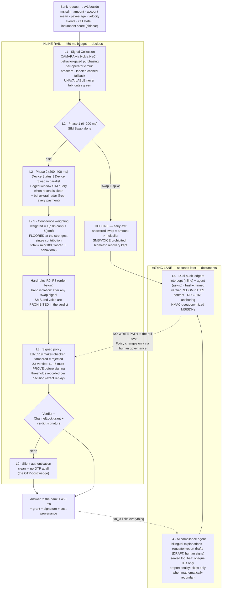
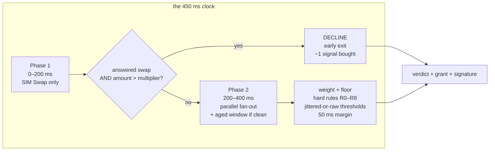
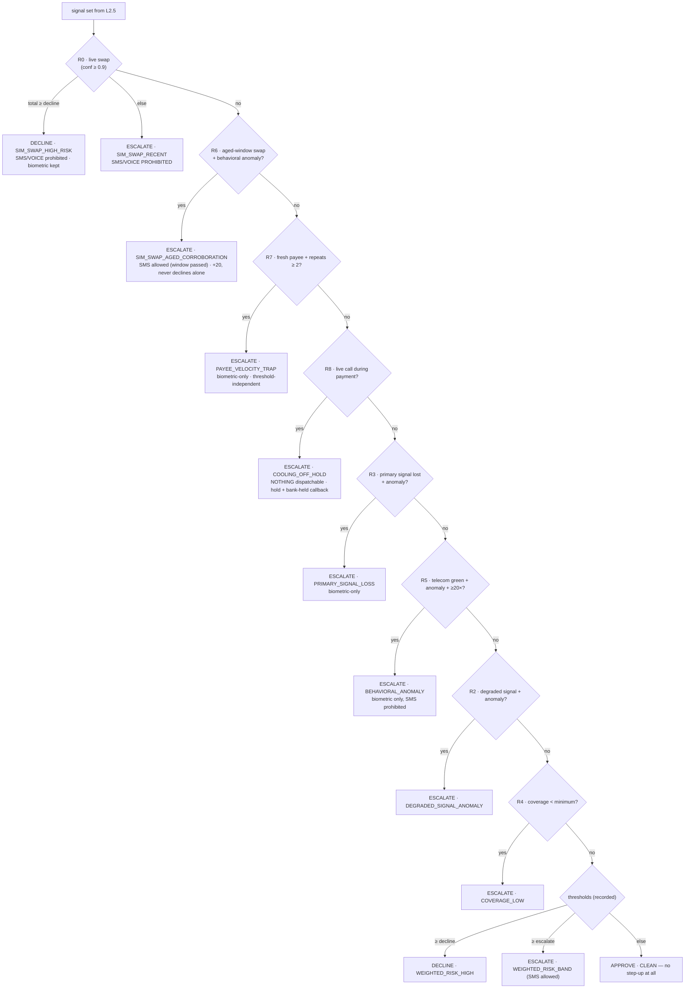

# Tasdiq — Architecture (deep dive)

Three views: the layers, the decision pipeline (time), and ChannelLock
enforcement (trust). Companion to the [README](../README.md); honest limits
in [PRODUCTION_DELTA](PRODUCTION_DELTA.md).

## 1 · The six layers



**How to read it:** the top block races the 450 ms clock (evidence → timing
→ weighting → judgment → answer). L0 is the reward for a clean pass: no OTP
at all. The bottom block runs after the bank already has its answer. The
red dashed path is the constitutional rule: **the agent can never write
back into the payment rail.**

## 2 · Decision pipeline



**One transaction's life** (the 52,000 attack):

```mermaid
sequenceDiagram
    participant B as Bank
    participant E as Tasdiq engine
    participant N as Nokia NaC (CAMARA)
    participant L as Intercept ledger
    participant G as Bank OTP gateway
    B->>E: POST /v1/decide — 52,000 (52× mean), swapped MSISDN
    E->>N: Phase 1 · SIM Swap check
    N-->>E: swapped = true (confidence 1.0)
    E->>E: 52× > 40× multiplier → EARLY EXIT
    E-->>B: DECLINE · band SIM_SWAP_INSTANT_PATTERN<br/>step_up: allowed [WEBAUTHN, IN_APP_BIOMETRIC]<br/>prohibited [SMS, VOICE] · verdict signature
    E->>L: append (hash-chained, signature persisted)
    B->>G: dispatch attempt: SMS
    G->>G: verify ChannelLock grant locally (~1 ms)
    G-->>B: REFUSED — CHANNEL_PROHIBITED<br/>(no SMS was ever sendable)
    Note over G: Tasdiq could be offline —<br/>the grant verifies locally; SMS stays refused
```

## 3 · Hard rules — evaluation order (first match wins)



## 4 · ChannelLock — how enforcement works

```mermaid
sequenceDiagram
    participant B as Bank orchestrator
    participant T as Tasdiq /v1/decide
    participant G as OTP gateway (bank side)
    Note over T: verdict computed; includes<br/>Ed25519-signed grant:<br/>allowed[] · prohibited[] · policy hash<br/>nonce · audience · 60–120 s TTL
    B->>T: decide(payment)
    T-->>B: verdict + grant (compact token)
    B->>G: send channel X + token
    G->>G: verify signature · expiry · nonce<br/>audience · policy hash · channel ∈ allowed
    alt channel prohibited or anything invalid
        G-->>B: REFUSED (reason code) — logged to audit
    else channel allowed, token valid
        G-->>B: dispatched (nonce burns — single use)
    end
    Note over G: verification is LOCAL — no call to Tasdiq.<br/>A Tasdiq outage never re-enables SMS.
```

**Deployment ladder:** `shadow` (log would-have-refused) → `alert`
(dispatch + alert) → `enforce` (refuse). The mock gateway at
`/v1/stepup/dispatch` implements all three.

## 5 · Fail-safe direction

Missing / degraded / timed-out signals carry confidence 0 with a label, and
the rules **tighten** — an attacker who forces a blind state forces a
stricter bank, never a blinder one. Risk-sensitive degraded modes (per
operator outage × transaction size × device trust) are the bank's policy to
own; Tier-0 quiet traffic survives outages by construction (it buys no
signals).
